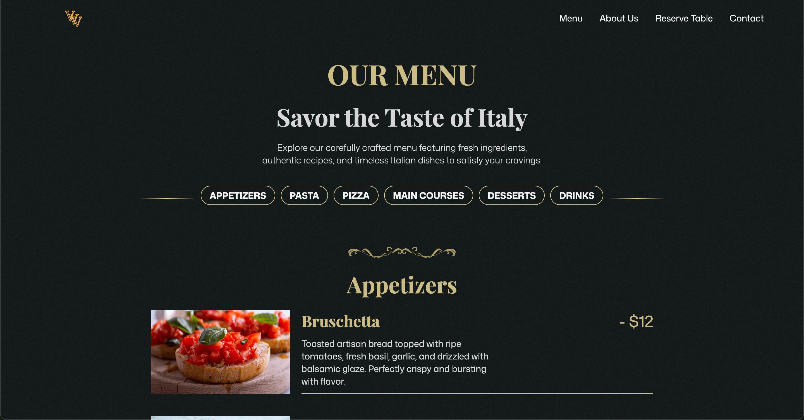

# Veni, Vidi, Vici 🍷

A modern Italian restaurant website showcasing scroll-driven animations, responsive design, and production-grade frontend engineering.

**Live demo:** [vini-vidi-vici.vercel.app](https://vini-vidi-vici.vercel.app)

Add screenshots here once you have them:



## About

Veni Vidi Vici is a fictional Italian restaurant concept built as a frontend portfolio piece. The focus is on polished motion design, performance, and clean, maintainable code — a scroll-scrubbing video hero, animated sections, and a fully responsive layout.

## Tech Stack

- **Framework:** Next.js (App Router)
- **Language:** TypeScript
- **Styling:** SCSS Modules
- **Animation:** GSAP (ScrollTrigger, SplitText) via `@gsap/react`
- **Testing:** Playwright (E2E)
- **Deployment:** Vercel

## Features

- **Scroll-scrubbing video hero** — the hero video plays frame-by-frame as you scroll, powered by GSAP ScrollTrigger with pinning
- **Animated sections** — text and galleries reveal on scroll with staggered GSAP animations
- **Interactive menu** — sticky category selector with active states and smooth scroll-to-section navigation
- **Reservation form** — with date picker, past-time disabling, inline validation, and a confirmation toast
- **Responsive mobile nav** — fullscreen hamburger menu overlay
- **Contact form** — with inline validation
- **Performance-optimized** — compressed and lazy-loaded videos, Next.js image optimization (AVIF/WebP), and intersection-observer lazy loading
- **SEO-ready** — per-page metadata, `robots.ts`, `sitemap.ts`, and JSON-LD Restaurant structured data
- **Accessible** — semantic markup, ARIA labels, and keyboard-navigable links
- **Custom error handling** — 404 page and error boundary

## Running Locally

```bash
# clone the repo
git clone https://github.com/beeeen498/vini-vidi-vici.git
cd vini-vidi-vici

# install dependencies
npm install

# run the dev server
npm run dev
```

Open [http://localhost:3000](http://localhost:3000) to view it.

## Testing

End-to-end tests are written with Playwright, covering the reservation flow and page navigation across Chromium, Firefox, and WebKit.

```bash
# run all tests
npx playwright test

# run with the interactive UI
npx playwright test --ui
```

## Credits

Image and video credits are listed on the [credits page](https://vini-vidi-vici.vercel.app/credits).

Created by **Ben Kedem**.